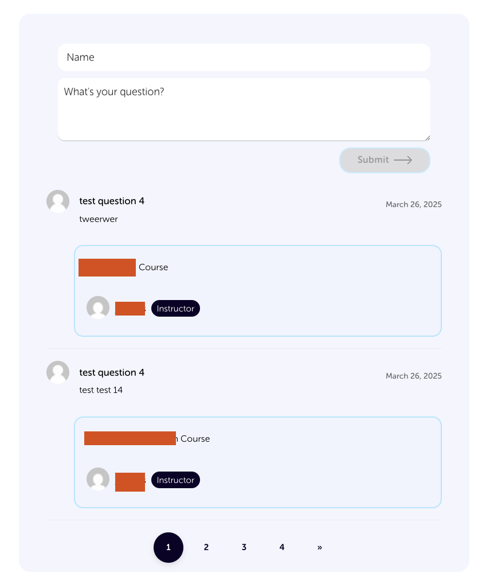

Code Fortress 

Question & Answer compatible with LearnDash

A powerful question and answer system designed specifically for LearnDash LMS that enhances student engagement through interactive Q&A functionality on courses, lessons, and topics.
this Q&A system seamlessly integrates with LearnDash to provide a comprehensive question and answer platform directly within your learning management system. Students can ask questions related to specific course content, and instructors can provide answers, creating a collaborative learning environment.

Features:

- Course-Specific Q&A: Questions are tied to specific courses, lessons, or topics
- Real-Time Updates: Questions and answers update in real-time without page refreshes using WordPress Heartbeat API
- Moderation System: Optional moderation workflow for questions before they become visible
- AJAX Pagination: Smooth, AJAX-powered pagination that preserves proper URL structure
- Elementor Compatible: Full compatibility with Elementor page builder
- Email Notifications: Automatic email notifications for new questions and answers
- User-Friendly Interface: Clean, responsive design that works on all devices
- Question Voting: Optional voting system for questions and answers
- Admin Dashboard: Comprehensive admin interface for managing questions and answers
- Shortcodes: Flexible shortcodes for displaying Q&A sections anywhere
- Auto-Insert: Optional automatic insertion of Q&A sections into LearnDash content

Usage:

Automatic Insertion - Enable auto-insert in the plugin settings to automatically add Q&A sections to your LearnDash courses, lessons, or topics.

Shortcodes
Use the following shortcodes to add Q&A functionality anywhere:
[cfqa_form] - Displays the question submission form
[cfqa_list] - Displays the list of questions with pagination

Admin Management

Access the Q&A management dashboard from the WordPress admin menu under "Q&A System". From there you can:

- Moderate pending questions
- Respond to questions
- Manage existing Q&A content

Configuration

Visit the Q&A System settings page to configure:

- Questions per page
- Moderation requirements
- Email notification settings
- Auto-insert settings for different LearnDash content types

Compatibility

- WordPress 5.8+
- PHP 7.4+
- LearnDash LMS (required)
- Elementor page builder (fully compatible)
- Any WordPress theme
- Responsive Design

🛟 Support
For support, feature requests, or bug reports, please visit our support page or contact us directly.

📝 License

This plugin is licensed under the GPL v2 or later.

🧑‍💻 Developer Notes
The plugin uses AJAX for seamless page transitions and updates
Full Elementor compatibility with special handling in editor mode
Clean pagination URLs maintain proper browser history state

